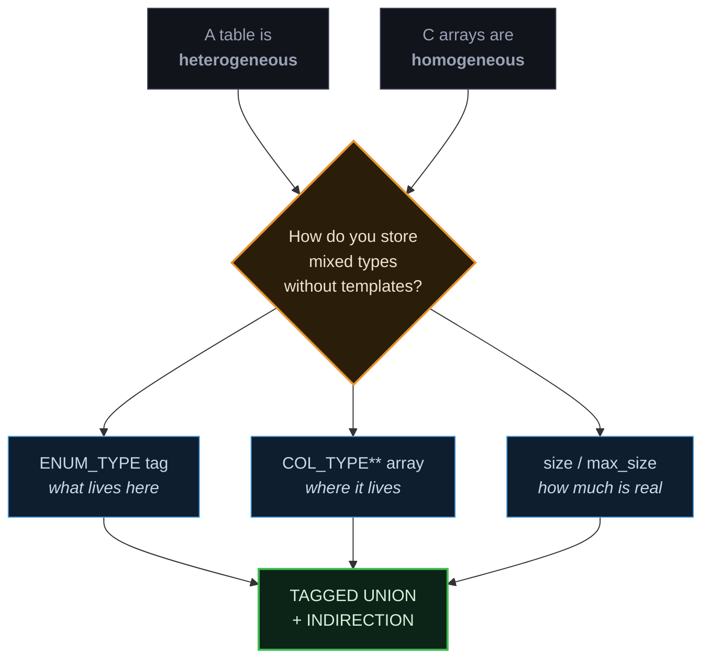
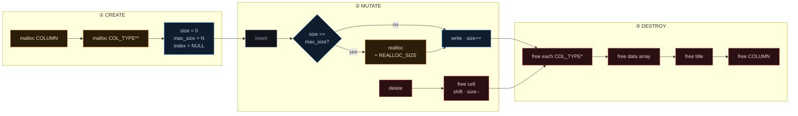
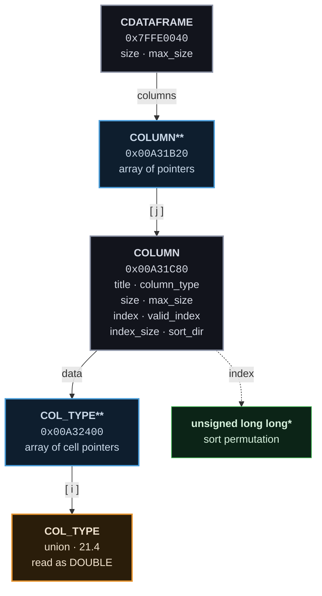
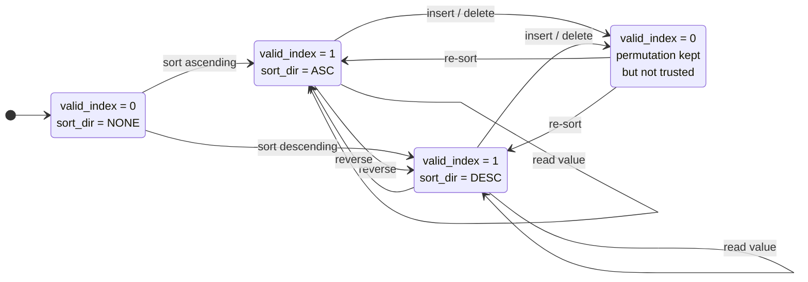
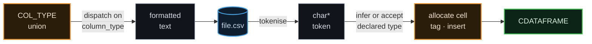

<div align="center">




<br>

**A DataFrame engine rebuilt from first principles — no libraries, no abstractions, just pointers and `malloc`.**

<br>


<br>

<a href="#01--system-overview"></a>
<a href="#02--memory-model"></a>
<a href="#03--type-system"></a>
<a href="#04--dataframe-architecture"></a>
<a href="#06--sorting-engine"></a>
<a href="#08--build--run"></a>

<br><br>


<br>

<sub><code>C</code> · <code>MANUAL MEMORY</code> · <code>TAGGED UNIONS</code> · <code>POINTER ARITHMETIC</code> · <code>DYNAMIC ARRAYS</code> · <code>CSV I/O</code></sub>

</div>

<br>

```
─────────────────────────────────────────────────────────────────────────────
  §01 SYSTEM      §02 MEMORY      §03 TYPES       §04 STRUCTURE
  §05 OPERATIONS  §06 SORTING     §07 CSV         §08 BUILD      §09 ORIGINS
─────────────────────────────────────────────────────────────────────────────
```

<br>

---

## 01 · SYSTEM OVERVIEW

<table>
<tr>
<td width="56%" valign="top">

A DataFrame gives you heterogeneous columns, dynamic growth, and typed cell access. Python hands you that for free. **C hands you `void*` and a warning.**

`CDataFrame Core` implements the same contract downward: a three-level pointer hierarchy where every allocation is explicit, every type is tagged, every capacity is tracked separately from occupancy, and every mutation has a defined effect on the index state.

There is no garbage collector to catch a mistake here. A column that grows without `realloc` corrupts the heap. An index left stale after a delete silently returns the wrong row. The engine is a study in the invariants that higher-level languages hide.

> [!NOTE]
> Nothing here is imported. Dynamic arrays, tagged unions, index permutations and CSV parsing are written out by hand.

</td>
<td width="44%" valign="top">

```ini
[system]
name         = CDataFrame Core
language     = C (ISO C17)
paradigm     = manual memory management
allocation   = malloc / realloc / free
dependencies = none

[structure]
container    = CDATAFRAME
column       = COLUMN
cell         = COL_TYPE (union)
indirection  = 3 levels

[capabilities]
typing       = 8 tagged variants
growth       = amortised block realloc
sorting      = index permutation
persistence  = CSV read / write
```

<br>

| | |
|:--|:--|
| **Status** | `● functional` |
| **Principle** | `explicit > implicit` |
| **Runtime deps** | `0` |
| **Team** | `3 authors` |

</td>
</tr>
</table>

### The core problem



<div align="right"><sub><a href="#01--system-overview">▲ top</a></sub></div>

---

## 02 · MEMORY MODEL

The distinction that governs everything: **logical size is not physical capacity.**

```
  COLUMN "temperature"                              max_size = 16
  ┌────┬────┬────┬────┬────┬────┬────┬────┬────┬────┬────┬────┬────┬────┐
  │ ██ │ ██ │ ██ │ ██ │ ██ │ ██ │ ██ │ ░░ │ ░░ │ ░░ │ ░░ │ ░░ │ ░░ │ ░░ │
  └────┴────┴────┴────┴────┴────┴────┴────┴────┴────┴────┴────┴────┴────┘
    0    1    2    3    4    5    6    7    8    9   10   11   12   13
  └──────────── size = 7 ────────────┘└─────── allocated, unused ───────┘
       values the user can read           heap already paid for

  ██  live value      · dereferencing is legal
  ░░  reserved slot   · allocated, uninitialised, must not be read
```

> [!IMPORTANT]
> Reading past `size` is undefined behaviour even though the memory is yours. `size` is the contract with the caller; `max_size` is the contract with the allocator.

### Growth strategy

Naïve growth calls `realloc` on every insertion — `O(n)` copies for `n` insertions. The engine grows in blocks, amortising the cost.

```c
if (col->size == col->max_size) {
    unsigned int new_capacity = col->max_size + REALLOC_SIZE;
    COL_TYPE **grown = realloc(col->data, new_capacity * sizeof(COL_TYPE *));
    if (grown == NULL) return 0;          /* original block still valid */
    col->data     = grown;
    col->max_size = new_capacity;
}
col->data[col->size] = value;
col->size += 1;
```

<details>
<summary><b>▸ Why the result of <code>realloc</code> goes to a temporary first</b></summary>

<br>

```diff
- col->data = realloc(col->data, n);   /* leaks the original block on failure */
+ COL_TYPE **grown = realloc(col->data, n);
+ if (grown == NULL) return 0;
+ col->data = grown;
```

If `realloc` fails it returns `NULL` **without freeing the original block**. Assigning straight back to `col->data` overwrites the only surviving pointer to that block — the memory is now unreachable and unfreeable for the process lifetime.

Routing through a temporary means a failed reallocation leaves the column exactly as it was: still valid, still readable, still freeable. The insertion fails; the data does not.

</details>

### Allocation lifecycle



> [!WARNING]
> Deallocation runs the pointer chain in reverse. Freeing `COLUMN` before its `data` array orphans every cell it owns.

<div align="right"><sub><a href="#01--system-overview">▲ top</a></sub></div>

---

## 03 · TYPE SYSTEM

C has no runtime type information. The engine supplies its own: a **tagged union** — one enum recording what a cell is, one union holding what it contains.

```c
typedef enum {
    NULLVAL = 1,   /* absent value — distinct from zero */
    UINT,          /* unsigned int   */
    INT,           /* signed int     */
    CHAR,          /* char           */
    FLOAT,         /* float          */
    DOUBLE,        /* double         */
    STRING,        /* char*  — owned, heap-allocated */
    STRUCTURE      /* void*  — opaque payload        */
} ENUM_TYPE;

typedef union {
    unsigned int  UINT_VALUE;
    signed int    INT_VALUE;
    char          CHAR_VALUE;
    float         FLOAT_VALUE;
    double        DOUBLE_VALUE;
    char         *STRING_VALUE;
    void         *STRUCT_VALUE;
} COL_TYPE;
```

<table>
<tr>
<th align="left">TAG</th>
<th align="left">UNION MEMBER</th>
<th align="left">STORAGE</th>
<th align="left">OWNERSHIP</th>
</tr>
<tr><td><code>NULLVAL</code></td><td>—</td><td><code>none</code></td><td>—</td></tr>
<tr><td><code>UINT</code></td><td><code>UINT_VALUE</code></td><td><code>inline</code></td><td>by value</td></tr>
<tr><td><code>INT</code></td><td><code>INT_VALUE</code></td><td><code>inline</code></td><td>by value</td></tr>
<tr><td><code>CHAR</code></td><td><code>CHAR_VALUE</code></td><td><code>inline</code></td><td>by value</td></tr>
<tr><td><code>FLOAT</code></td><td><code>FLOAT_VALUE</code></td><td><code>inline</code></td><td>by value</td></tr>
<tr><td><code>DOUBLE</code></td><td><code>DOUBLE_VALUE</code></td><td><code>inline</code></td><td>by value</td></tr>
<tr><td><code>STRING</code></td><td><code>STRING_VALUE</code></td><td><code>indirect</code></td><td><b>column owns the buffer</b></td></tr>
<tr><td><code>STRUCTURE</code></td><td><code>STRUCT_VALUE</code></td><td><code>indirect</code></td><td>caller-defined</td></tr>
</table>

```
  ONE SLOT · EIGHT INTERPRETATIONS

  ┌──────────────────────────────────────────────┐
  │              sizeof(COL_TYPE)                │  ← size of the LARGEST
  ├──────────────────────────────────────────────┤     member, not the sum
  │ UINT_VALUE   ▓▓▓▓                            │
  │ INT_VALUE    ▓▓▓▓                            │
  │ CHAR_VALUE   ▓                               │
  │ FLOAT_VALUE  ▓▓▓▓                            │
  │ DOUBLE_VALUE ▓▓▓▓▓▓▓▓                        │
  │ STRING_VALUE ▓▓▓▓▓▓▓▓ ──▶ heap               │
  │ STRUCT_VALUE ▓▓▓▓▓▓▓▓ ──▶ heap               │
  └──────────────────────────────────────────────┘
        ▲
        └── column_type decides which member is legal to read
```

> A `CHAR` column and a `DOUBLE` column have identical memory footprints. That waste is the price of heterogeneity without templates.

<details>
<summary><b>▸ The two tags that behave differently</b></summary>

<br>

`STRING` and `STRUCTURE` store a pointer, not a value. Three consequences the other six tags don't have:

| Concern | Consequence |
|:--|:--|
| **Destruction** | Two-stage. Freeing the cell frees the pointer, not the buffer it addresses. Free the buffer first, or it leaks. |
| **Copying** | Shallow copy duplicates the address — two columns own one buffer, and the second `free` is a double-free. Deep copy duplicates the bytes and doubles the memory. |
| **Comparison** | Not `==`. Sorting a `STRING` column compares through `strcmp`; comparing the pointers themselves sorts by heap address, which is arbitrary. |

</details>

<div align="right"><sub><a href="#01--system-overview">▲ top</a></sub></div>

---

## 04 · DATAFRAME ARCHITECTURE

Three levels of indirection separate the container from a value. Each one buys a specific freedom.



```
                        ╔═══════════════════════════╗
                        ║        CDATAFRAME         ║   0x7FFE0040
                        ╠═══════════════════════════╣
                        ║  COLUMN **columns         ║ ──┐
                        ║  unsigned int size        ║   │  3 columns live
                        ║  unsigned int max_size    ║   │  8 slots allocated
                        ╚═══════════════════════════╝   │
                                                        │
             ┌──────────────────────────────────────────┘
             ▼
      ┌──────────┬──────────┬──────────┬─────┬─────┬─────┐
      │ COLUMN*  │ COLUMN*  │ COLUMN*  │  ░  │  ░  │  ░  │   COLUMN**
      └────┬─────┴────┬─────┴────┬─────┴─────┴─────┴─────┘
           │          │          │
           ▼          ▼          ▼
  ╔════════════════════════╗
  ║        COLUMN          ║   0x00A31C80      "temperature"
  ╠════════════════════════╣
  ║  char      *title      ║ ──▶ "temperature\0"
  ║  ENUM_TYPE  column_type║     DOUBLE
  ║  uint       size       ║     7          ◀── logical
  ║  uint       max_size   ║     16         ◀── physical
  ║  COL_TYPE **data       ║ ──┐
  ║  ull       *index      ║   │  sort permutation
  ║  uint       valid_index║   │  0 = stale
  ║  uint       index_size ║   │
  ║  int        sort_dir   ║   │  ASC | DESC | NONE
  ╚════════════════════════╝   │
                               ▼
      ┌────────────┬────────────┬────────────┬─────┬─────┐
      │ COL_TYPE*  │ COL_TYPE*  │ COL_TYPE*  │  ░  │  ░  │   COL_TYPE**
      └─────┬──────┴─────┬──────┴─────┬──────┴─────┴─────┘
            │            │            │
            ▼            ▼            ▼
       ┌─────────┐  ┌─────────┐  ┌─────────┐
       │ 21.4    │  │ 19.8    │  │ 23.1    │   union COL_TYPE
       │ DOUBLE  │  │ DOUBLE  │  │ DOUBLE  │   read via column_type
       └─────────┘  └─────────┘  └─────────┘
```

<table>
<tr><th align="left">LEVEL</th><th align="left">TYPE</th><th align="left">WHAT IT BUYS</th></tr>
<tr>
<td><code>1</code></td><td><code>COLUMN **columns</code></td>
<td>Columns are added and removed without moving the ones that stay. A pointer swap reorders the table.</td>
</tr>
<tr>
<td><code>2</code></td><td><code>COL_TYPE **data</code></td>
<td>The value array grows by <code>realloc</code> without invalidating anything holding a cell pointer.</td>
</tr>
<tr>
<td><code>3</code></td><td><code>COL_TYPE *cell</code></td>
<td>A cell can be absent. <code>NULL</code> encodes a missing value that no numeric sentinel could represent unambiguously.</td>
</tr>
</table>

```c
df->columns[j]->data[i]->DOUBLE_VALUE
/*  ▲           ▲        ▲
    │           │        └── level 3 · the value itself
    │           └─────────── level 2 · which row
    └─────────────────────── level 1 · which column          */
```

<div align="right"><sub><a href="#01--system-overview">▲ top</a></sub></div>

---

## 05 · OPERATIONS

Colour-coded by effect on state. Operations in red invalidate the column index.

```diff
  STRUCTURAL
+ create dataframe                    allocate container, size = 0
+ add column                          append COLUMN*, grow if saturated
- delete column                       free chain, compact pointer array
+ rename column                       replace title buffer

  CELL
+ insert value                        append typed cell, grow if saturated
- delete value                        free cell, shift left, size--
+ read value                          bounds-checked, tag-dispatched

  INSPECTION
  display full                        every row, every column
  display partial                     first N rows, subset of columns
  count occurrences                   cells equal to a target value
  count greater / lesser              cells above or below a threshold
  search value                        position of first match

  PERSISTENCE
+ export CSV                          write to disk
+ import CSV                          parse and type-infer
```

<details>
<summary><b>▸ Delete is the expensive one</b></summary>

<br>

Insertion at the tail is `O(1)` amortised. Deletion at an arbitrary position is not:

```
  before   [ A ][ B ][ C ][ D ][ E ][ ░ ][ ░ ]     size = 5
                      ▲
                   delete index 2

  step 1   free the cell at index 2                    ── prevents the leak
  step 2   shift indices 3..4 down by one               ── O(n − i) moves
  step 3   size--                                       ── 5 → 4
  step 4   valid_index = 0                              ── index now stale

  after    [ A ][ B ][ D ][ E ][ ░ ][ ░ ][ ░ ]     size = 4
```

Step 1 before step 2, always. Shifting first overwrites the pointer to the doomed cell, and the block it addressed is leaked permanently.

`max_size` does not decrease. The capacity stays paid for, ready for the next insertion.

</details>

<div align="right"><sub><a href="#01--system-overview">▲ top</a></sub></div>

---

## 06 · SORTING ENGINE

Sorting does not move data. It builds a **permutation of positions** and stores it alongside — the values stay where they were allocated.

```
  data (physical order, never moves)
  ┌──────┬──────┬──────┬──────┬──────┐
  │ 21.4 │ 19.8 │ 23.1 │ 18.2 │ 20.5 │
  └──────┴──────┴──────┴──────┴──────┘
      0      1      2      3      4

  index (ASC)                                 sort_dir    = ASC
  ┌──────┬──────┬──────┬──────┬──────┐        valid_index = 1
  │  3   │  1   │  4   │  0   │  2   │        index_size  = 5
  └──────┴──────┴──────┴──────┴──────┘
      │      │      │      │      │
      ▼      ▼      ▼      ▼      ▼
    18.2   19.8   20.5   21.4   23.1        ── logical order on read
```

Why a permutation rather than a physical reorder:

- **`STRING` cells never move.** Reordering pointers is a fixed cost per element regardless of what they address.
- **The original insertion order survives.** Physical order remains recoverable.
- **Sorting is reversible.** Reversing direction reverses the index, not the data.

### Index state machine



<table>
<tr><th align="left">FIELD</th><th align="left">STATES</th><th align="left">MEANING</th></tr>
<tr>
<td><code>valid_index</code></td><td><code>0</code> · <code>1</code></td>
<td><code>1</code> — the permutation matches the current data.<br><code>0</code> — data changed since the sort; the index must not be trusted.</td>
</tr>
<tr>
<td><code>index_size</code></td><td><code>0 .. size</code></td>
<td>Elements the index covers. A mismatch against <code>size</code> is itself a staleness signal.</td>
</tr>
<tr>
<td><code>sort_dir</code></td><td><code>ASC</code> · <code>DESC</code> · <code>NONE</code></td>
<td>Direction the index encodes. <code>NONE</code> means no sort has been applied.</td>
</tr>
</table>

```diff
  TRANSITIONS

+ sort ascending      → valid_index = 1   sort_dir = ASC    index built
+ sort descending     → valid_index = 1   sort_dir = DESC   index built
- insert value        → valid_index = 0                     index stale
- delete value        → valid_index = 0                     index stale
  read value          → valid_index unchanged               index preserved
```

> [!CAUTION]
> Every mutation invalidates the index. This is the invariant that makes the whole mechanism safe: a stale permutation returns wrong rows *silently*, with no crash and no warning — and silent wrongness is the worst failure mode a data structure can have. The flag turns it into a detectable condition.

<div align="right"><sub><a href="#01--system-overview">▲ top</a></sub></div>

---

## 07 · CSV PERSISTENCE

Serialisation is where the type system meets a format that has no types.



<details>
<summary><b>▸ What a round trip does not preserve</b></summary>

<br>

CSV stores characters. Everything the tag carried has to be reconstructed or declared.

| Concern | Consequence |
|:--|:--|
| **Type erasure** | `21.4` could be `FLOAT` or `DOUBLE`. Without a declared schema the reader must guess, and a guess can silently narrow precision. |
| **`NULLVAL` vs empty** | An absent value and an empty string are both nothing between two commas. The distinction is lost unless encoded explicitly. |
| **Float round-tripping** | A `double` printed with too few digits does not read back to the same bits. Precision loss here is a formatting decision, not a rounding error. |
| **Delimiter collision** | A `STRING` cell containing a comma breaks the format unless quoted and escaped. |

</details>

<div align="right"><sub><a href="#01--system-overview">▲ top</a></sub></div>

---

## 08 · BUILD & RUN

### Toolchain

<table>
<tr><td width="30%"><b>IDE</b></td><td>Visual Studio 2022 Community — <i>Desktop development with C++</i> workload</td></tr>
<tr><td><b>Language standard</b></td><td><code>ISO C17 (/std:c17)</code> — C11 also compiles</td></tr>
<tr><td><b>Target</b></td><td><code>x64 · Release</code></td></tr>
<tr><td><b>Prebuilt binary</b></td><td><code>/x64/Release/CDataframe.exe</code></td></tr>
</table>

### Clone and build

```bash
git clone https://github.com/GingaShift/CDataframe-Eden-Adam-Bryan-PP.git
```

Open `CDataframe.sln`, then press <kbd>F5</kbd>.

### Required project settings

> [!WARNING]
> Two settings must be changed or the build fails. Both live in **Project → Properties**.

```ini
[C/C++ > General]
SDL checks = No (/sdl-)
; MSVC rejects scanf as unsafe under SDL and demands scanf_s.
; Disabling this keeps the source portable to standard C.

[C/C++ > Language]
C Language Standard = ISO C17 (/std:c17)
; Resolves E1072 — declarations after statements, a C99+ construct
; that the default MSVC C mode rejects.
```

### First session

```
  ┌─────────────────────────────────────────────────────────────┐
  │  1.  run                          →  main menu              │
  │  2.  11                           →  create empty dataframe │
  │  3.  15                           →  populate with sample   │
  │  4.  21                           →  display full table     │
  │  5.  22   then  -1  then  10      →  first 10 rows          │
  └─────────────────────────────────────────────────────────────┘

  then explore:  sort · search · add column · rename · export CSV
```

### Screenshots

<div align="center">


<br><sub>Main program interface</sub>

<br><br>


<br><sub>Inserting and displaying tabular data</sub>

</div>

<div align="right"><sub><a href="#01--system-overview">▲ top</a></sub></div>

---

## 09 · PROJECT ORIGINS

Built as a systems programming project with one rule: **implement it, don't import it.** No third-party containers, no generic-collection library, no hash map lifted from elsewhere.

The engine exists in two generations, both preserved in the source:

```c
#pragma region CDataframe 1
    /* v1 — original implementation, French identifiers        */
#pragma endregion

#pragma region CDataframe 2
    /* v2 — English identifiers, modular decomposition,        */
    /*      extended type coverage and index handling          */
#pragma endregion
```

<details>
<summary><b>▸ What the exercise actually teaches</b></summary>

<br>

Every convenience a high-level language provides turns out to be a decision someone made and hid:

- `list.append()` conceals an amortised growth strategy and a failure mode when the allocator says no.
- Heterogeneous columns conceal a tagged union, and the memory it wastes on the smaller variants.
- `del row[i]` conceals a shift, a free, and a cache invalidation — in that order, or it leaks.
- `df.sort()` conceals the choice between permuting an index and moving the payload.
- Reading a CSV conceals type inference, and every ambiguity that inference has to resolve by guessing.

Writing them out doesn't make the abstractions less valuable. It makes them legible.

</details>

<br>

### Authors

<div align="center">

<table>
<tr>
<td align="center" width="33%"><b>Eden Elfassy</b></td>
<td align="center" width="33%"><b>Bryan Tewouda</b></td>
<td align="center" width="33%"><b>Adam Assayag</b></td>
</tr>
</table>

</div>

<br>

---

<div align="center">

<a href="https://github.com/GingaShift/CDataframe-Eden-Adam-Bryan-PP">

</a>
<a href="https://github.com/GingaShift/CDataframe-Eden-Adam-Bryan-PP/issues">

</a>

<br><br>

<sub>⭐ If this made the abstractions legible, consider starring the repo.</sub>

<br>



</div>
